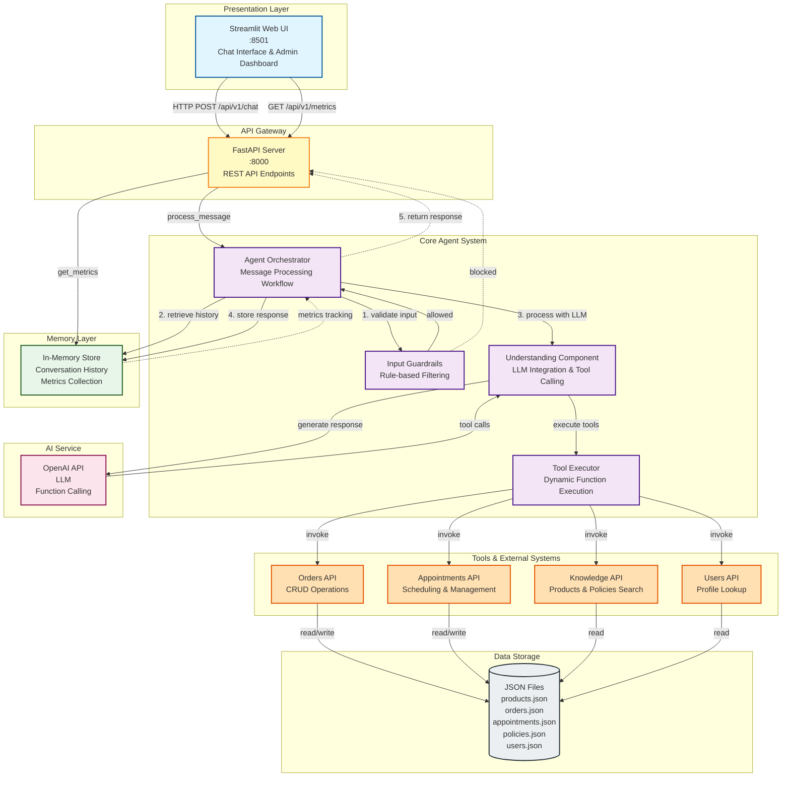

# The Intelligent Service Concierge

Intelligent Assistant for a high-end lifestyle brand that offers both physical products (clothing, gear) and services (fitting appointments, styling sessions).

# Quick Start

## Run App with Docker

The easiest way to run the application is using Docker. This method requires no local Python setup.

### Prerequisites

- Docker
- Docker Compose
- OpenAI API key

### Running with Docker

1. Copy the example environment file and add your OpenAI API key:

```bash
cp .env.example .env
```

Edit `.env` and add your OpenAI API key:
```
OPENAI_API_KEY=your-api-key-here
```

2. Build and start the service:

```bash
docker compose up --build
```

The service will be available at `http://localhost:8000`

3. View the API documentation at `http://localhost:8000/docs`

### Docker Commands

```bash
# Start the service in detached mode
docker compose up -d

# Stop the service
docker compose down

# View logs
docker compose logs -f

# Rebuild the container after changes
docker compose up --build

# Stop and remove containers, networks, and volumes
docker compose down -v
```

# Setup developer environment

To develop locally without Docker, you need to setup your local machine.

## Setup venv

You need to setup virtual environment, simplest way is to run from project root directory:

```bash
$ . ./setup_dev_env.sh
```

This will create a new venv, install dependencies and activate the environment.

## Run pre-commit

To reformat and lint all files in the project, use:

```
uv run pre-commit run --all-files
```

or

```
make lint
```

The used linters are configured in `.pre-commit-config.yaml`.

# Run App Locally

After setting up your development environment, you can run the application in two ways:

## Option 1: FastAPI Backend (API Server)

Run the FastAPI server for API access:

```bash
uv run uvicorn concierge.app:app --reload --host 0.0.0.0 --port 8000
```

Or use the Makefile shortcuts:

```bash
make run  # Run in production mode
make dev  # Run in development mode with auto-reload
```

The API will be available at:
- API endpoint: `http://localhost:8000/api/v1/chat`
- Interactive API docs: `http://localhost:8000/docs`
- Alternative docs: `http://localhost:8000/redoc`

### Test the API

You can test the API using curl:

```bash
curl -X POST "http://localhost:8000/api/v1/chat" \
  -H "Content-Type: application/json" \
  -d '{
    "conversation_id": "test-123",
    "message": "Show me merino wool jackets"
  }'
```

## Option 2: Streamlit Demo (Interactive UI)

Run the Streamlit demo for an interactive chat interface:

```bash
uv run streamlit run examples/demo_streamlit.py
```

Or use the Makefile shortcut:

```bash
make demo-streamlit
```

The Streamlit app will automatically open in your browser at `http://localhost:8501`

### Features of the Streamlit Demo

- Interactive chat interface
- Conversation history
- Example users in the sidebar
- Sample queries to get started
- Clear chat functionality

- **Admin mode with analytics dashboard**
  - View global metrics across all conversations
  - Monitor conversation-specific metrics
  - Analyze tool usage patterns
  - Track message processing latency
  - Monitor guardrail blocks


## Analytics & Metrics

The concierge service includes built-in analytics to track message processing performance and tool usage.

### Via API Endpoints

Get metrics for a specific conversation:
```bash
curl "http://localhost:8000/api/v1/metrics/conversation/{conversation_id}"
```

Get global metrics:
```bash
curl "http://localhost:8000/api/v1/metrics/global"
```

### Via Streamlit Dashboard

1. Run the Streamlit demo:
   ```bash
   make demo-streamlit
   ```

2. Enable admin mode:
   - In the sidebar, enter the admin password set in .env file
   - Click "Toggle Admin Mode"

3. Navigate to the "📊 Metrics" tab to view:
   - Real-time global metrics
   - Current conversation metrics
   - Tool usage charts
   - Raw metrics data in table format


# Work with the project

## Manage dependencies

The project uses `uv`, a fast and modern Python package manager that manages dependencies via the `pyproject.toml` file.

### Add dependencies

To add a new package and update the `pyproject.toml` and `uv.lock` files, use:

```bash
uv add <package-name>
```

You can also specify versions, extras, or assign to specific groups:

```bash
uv add requests==2.31.0     # specific version
uv add fastapi[all]         # with extras
uv add --dev pytest         # dev-only dependencies
uv add --group foo uvicorn  # custom group from [dependency-groups]
```

### Remove dependencies

To remove a package and clean up both `pyproject.toml` and `uv.lock` files, use:

```bash
uv remove <package-name>
```

Example:

```bash
uv remove pandas
```

### Lock & install dependencies

Dependency metadata can also be updated manually by editing the `pyproject.toml` file directly.
After making changes, run the following commands to update the `uv.lock` file and install the dependencies:

```bash
uv lock
uv sync
```

You can also sync specific groups:

```bash
uv sync --dev        # development dependencies
uv sync --group foo  # custom dependency group in dependency-groups
```

# Service Concierge Architecture

## High-Level Architecture Diagram



## Component Overview

### Presentation Layer
- **Streamlit Web UI**: Interactive chat interface with admin dashboard for metrics visualization

### API Gateway
- **FastAPI Server**: RESTful API with endpoints for chat, metrics, and health checks

### Core Agent System
- **Agent Orchestrator**: Manages message processing workflow and coordinates components
- **Input Guardrails**: Validates queries against allowed topics (products, orders, appointments)
- **Understanding Component**: Integrates with OpenAI for language understanding and tool calling
- **Tool Executor**: Dynamically executes tools and formats results

### Memory Layer
- **In-Memory Store**: Maintains conversation history and collects performance metrics

### Tools & External Systems
- **Orders API**: Order management (create, update, cancel, swap items)
- **Appointments API**: Appointment scheduling and management with conflict detection
- **Knowledge API**: Product catalog and policy document search
- **Users API**: User profile lookup by ID, email, or phone

### AI Service
- **OpenAI API**: LLM with function calling capabilities

### Data Storage
- **JSON Files**: Mock database with sample data for products, orders, appointments, policies, and users

## Request Flow

1. User sends message through Streamlit UI or direct API call
2. FastAPI receives request at `/api/v1/chat` endpoint
3. Agent validates input through Guardrails
4. Agent retrieves conversation history from Memory
5. Understanding component processes message with OpenAI
6. OpenAI returns tool calls (if needed)
7. Tool Executor invokes appropriate APIs (Orders, Appointments, Knowledge, Users)
8. APIs read/write to JSON data files
9. Results feed back to OpenAI for response generation
10. Agent stores response in Memory and records metrics
11. Final response returned to user

## Key Features

- **Multi-Intent Handling**: Processes complex queries spanning multiple domains
- **Agentic Loop**: Self-correcting with up to 10 tool-calling iterations
- **Real-time Metrics**: Tracks latency, tool usage, and guardrail violations
- **Luxury Concierge Focus**: Specialized for high-end retail customer service
- **Stateless Design**: Scalable API with in-memory session management
